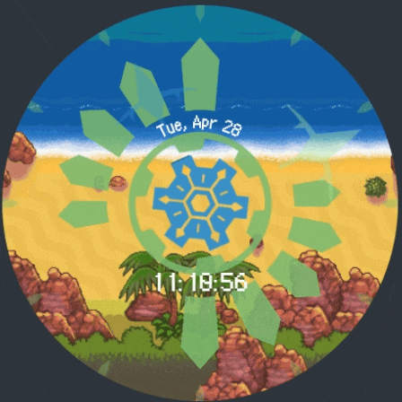

# time-gear-watch
 A Pokemon Mystery Dungeon: Explorers of Sky themed watch face for Wear OS

 ---

 The watch face features a Time Gear that ticks with each second, as well as a rotating hour and minute hand. The hour/minute hands and the rest of the time gear pattern alternate in opacity to create a glow in and out effect. Every 30 seconds the watch background changes as well. Perfect for any adventuring explorer!
<p>
  
  
  
  
</p>
The colors are a bit washed out in the gifs, but they look much more vibrant on the watch! I use a Pixel Watch 3.


## Loading the Project
You will need Watch Face Studio to load this project. It can be downloaded here: https://developer.samsung.com/watch-face-studio/download.html

Once installed, open the application and select `File -> Open Project` and open `timegear.wfs`.

## Loading it onto your Watch with Watch Face Studio

**For the easiest directions, you can follow this youtube tutorial starting from 1:39. https://youtu.be/sF3us77rbdc?si=8M9ulIMDcbyEWGuQ&t=99**

Otherwise here are instructions:

1. **Enable debug mode on your WearOS watch.**
     - On your watch, open the Settings app.
     - Scroll down and tap on "About" or "System" (depending on your watch model).
     - Look for the "Build number" and tap on it multiple times (usually 7 times) until you see a message that says "You are now a developer!" or "Developer mode has been enabled!"
     - Go back to the main Settings menu and you should now see a new option called "Developer options" or "Developer settings". Tap on it.
     - Look for the "Debugging" section and enable the "ADB debugging" option. This will allow you to connect your watch to your computer and install apps using ADB commands.
2. **Download the Android SDK Platform Tools to run `adb` commands.**
   - Download the Android SDK Platform Tools here: https://developer.android.com/tools/releases/platform-tools
   - Extract the downloaded zip file to a location on your computer where you can easily access it.

3. **Open a command prompt / terminal and navigate into the extracted folder.**

```cmd
cd path\to\extracted\platform-tools
```

4. **Wirelessly connect to your watch using ADB.**
   - Make sure your computer and watch are on the same Wi-Fi network.
   - On your watch, go to the "Developer options" or "Developer settings" menu and look for the "Wireless debugging" option. Enable it.
   - In the Wireless Debugging menu, scroll to the bottom and select "Pair new device" and note the pairing code and IP address displayed on your watch.
   - In your command prompt / terminal, run the following command to pair your watch with your computer, replacing `<pairing_code>` and `<ip_address>` with the values from your watch:
   - ```cmd
     adb pair <ip_address>:<port> <pairing_code>
     ```
   - After running the command, you should see a message confirming that the pairing was successful.
   - Once paired, go back to the Wireless Debugging menu on your watch and find the IP address and port number for the wireless debugging connection. It should be in the format `<ip_address>:<port>`. **Note that this might be a different port than the one used for pairing.**
   - In your command prompt / terminal, run the following command to connect to your watch, replacing `<ip_address>` and `<port>` with the values from your watch:
   - ```cmd
     adb connect <ip_address>:<port>
     ```
   - After running the command, you should see a message confirming that the connection was successful.
5. Open Watch Face Studio and load the project as described in the "Loading the Project" section above.
6. On the top right, click the "Run on device" button. You should see your watch listed as a target device. Select it and click "OK" to install the watch face on your watch.

## Credits

Wondermail Font: https://www.dafont.com/wonder-mail.font

Foundbound GIF: https://www.reddit.com/r/MysteryDungeon/comments/lbm4s0/some_more_wallpapers_that_i_exported_with/

Beach at Dusk GIF: https://www.reddit.com/r/MysteryDungeon/comments/lb0y26/some_wallpapers_i_exported_using_skytemple/

Guild Night GIF: https://www.pinterest.com/pin/713750240926838101/

Beach at Dusk (Bubbles) GIF: https://www.reddit.com/r/MysteryDungeon/comments/j6euvd/spent_2_hours_creating_gifs_of_on_the_beach_at/

Time Gear SVG: https://www.reddit.com/r/MysteryDungeon/comments/1m6d9jg/pmd2_time_gear_svg/
https://pastebin.com/5qD8gutW